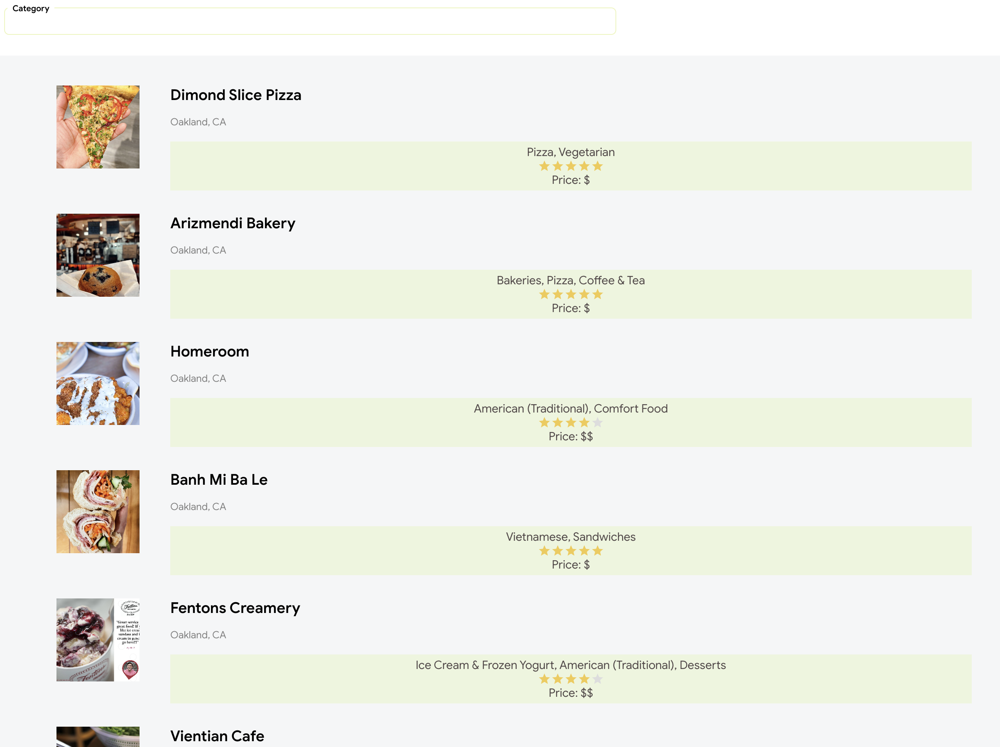
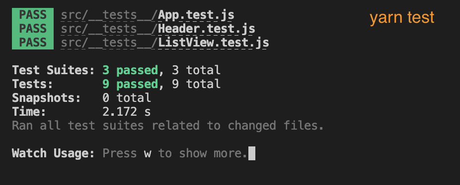

## Bay area restaurant view (by business category) 

---
1. [Overall structure ](#✨overall-structure)
2. [Server](#🔧-server)
3. [Client](#👀-client)
4. [Instructure](#📄-instruction)
5. [Note](#note)

---

### ✨Overall structure 
- Question to solve: given user is in bayarea, and render business that associated with their choice of food category

- Data model: 

    - Relational data model is decicded to be used for persistent data in the system. Since our simplified database is intend to store business info, which has rigid structure and well-structured data, one simple relational table could be used to store all the relevant info with respect to an unique identified (ID).
    - use GraphQL server to serve user query. The reason is that for scalability and ease of use. GraphQL will allow us to query data source with specific fields which we are interested in, which means that we potentially could have flexble payload. And we can easily define our payload structure via Schema Definition Language (SDL).

- Interface:

    - Structured in a vertical alignment. With a selctable dropdown on the top which will allow user to select their preferred category. Following to the dropdown, we show a vertical list of restaurants that have relevant info to display, e.g: price, rating. We also provide the feature to do a client side sorting by categories and matched category will be highlignted.

### 🔧 Server

- Request resouce from Yelp GraphQL service
- Update embedded DB (SQLite) upon response derived from calling Yelp Api 
- Serve Data using Apollo server
    - Schema (`schema.js`)
    - Query (`service.js`)

### 👀 Client

- Fetch data from Apollo graphQL server querying business cateogry, and then fetch business from server
- Render business info via a modular component
- Cache existing business info to limit on request fetch rate
- Highlight matched category on the listing
- Additionally, unit test is provided to checks major components

### 📄 Instruction

- (1) Server setup

```
cd server
yarn install
yarn start
```

expect to see `Server ready at http://localhost:4000/`, and server should be ready to server query from sandbox at `http://localhost:4000/` 


- (2) Client setup
```
cd client
yarn install
yarn start
```
expect to see `webpack compiled`, and client should be ready to view at `http://localhost:3000/`



- (3) (Client) Unit test setup
```
cd client
yarn test
```
expect to see 
`Test Suites: 3 passed, 3 total ` & `Tests: 9 passed, 9 total`



- (4) DB refresh


### Note

Note that for easy review, we have removed some vulnerable design choice. Some concerns are listed down below for clarification.
1. put Yelp credential inside `server/assets/config.js` as well as `.env`. Instead, we should only keep this in local (or at least put in .gitignore). I am uploading it for review / demo purpose.

2. in order to check on eligibility of malicious site from requesting data, a simple Cross-Origin Resource Sharing (CORS) policy was made (but commented out for review / demo purpose) to restrict query request from localhost port 3000 in `app.js`.

3. used a naive rate limiting on the client side by consulting client side cache first before hitting server. We would also assume we should have implement a rate limit on server.


